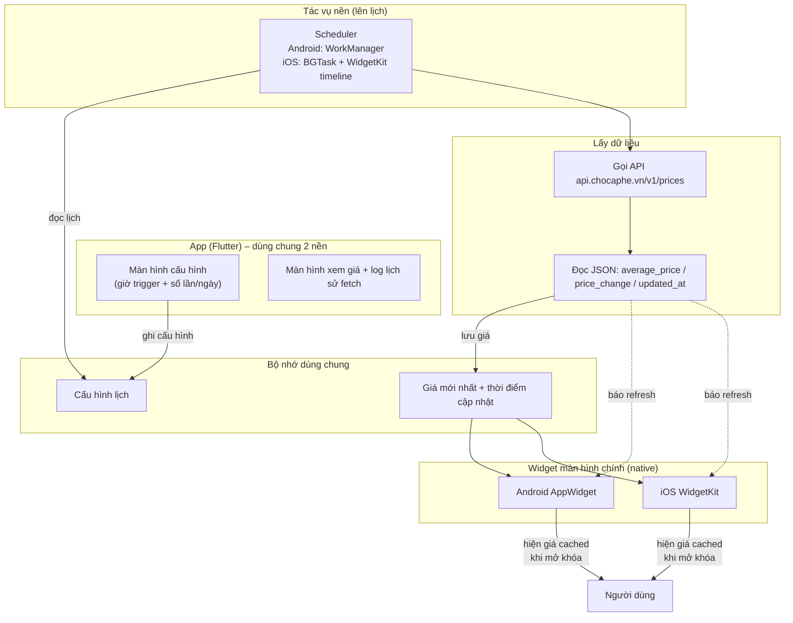

# Kế hoạch: App báo giá cà phê trên Widget (iOS + Android)

**Ngày lập:** 09/09/2026
**Người dùng:** mới bắt đầu làm app, chỉ có máy **Windows**
**Mục tiêu:** mở khóa màn hình là thấy ngay giá cà phê (lấy từ trang chợ cà phê) trên widget. Cấu hình được **giờ trigger** và **số lần/ngày**. Dùng cá nhân trước, sau này có thể publish.

---

## 1. 4 sự thật phải biết TRƯỚC khi bắt tay (tránh phí công)

1. **Build iOS bắt buộc có Mac + Xcode.** Không thể "build ra file cài iPhone" trên Windows thuần. Giải pháp:
   - *Giai đoạn 1:* làm **Android trước** trên Windows (cài APK thẳng, không cần cửa hàng, không cần tài khoản trả phí).
   - Viết code bằng **Flutter** → 1 bộ code chạy cả 2 nền tảng. Khi nào cần iOS mới build thêm.
   - Khi muốn iOS: dùng **Mac trên mây** (Codemagic / GitHub Actions chạy máy macOS) để build ra file `.ipa`, hoặc mượn/kiếm 1 Mac. Cần tài khoản Apple Developer **$99/năm** để cài lên iPhone thật (bản miễn phí chỉ 7 ngày, phải ký lại).

2. **Widget màn hình chính là code "native"** — không framework đa nền tảng nào làm được widget cho cả 2 mà không viết phần native:
   - Android widget: Kotlin + `AppWidgetProvider`.
   - iOS widget: Swift + WidgetKit.
   - Nên **tách kiến trúc**: app (Flutter, dùng chung) + widget (native, viết riêng từng nền). Đây là cách chuẩn.

3. **iOS KHÔNG cho widget "chạy đúng giờ tuyệt đối".** Hệ điều hành tự điều phối lúc widget được refresh (có ngân sách giới hạn). Android thì chủ động hơn nhiều (lên lịch gần đúng giờ được).
   - Pattern đáng tin nhất cho cả 2 nền: **Widget luôn hiện "giá mới nhất đã lưu sẵn"** → mở khóa là thấy ngay (không chờ fetch). Phần *fetch theo lịch* chạy ngầm, xong thì lưu giá + báo widget cập nhật.
   - Với yêu cầu "trigger đúng giờ + số lần/ngày": **Android làm được gần như chính xác**, **iOS chỉ xấp xỉ** (khoảng đúng giờ, hệ điều hành có thể trễ/lỡ 1 lượt). Cần chấp nhận giới hạn này.

4. **"Sau này publish"** cần: Google Play Console **$25 (một lần)** + Apple Developer **$99/năm**, kèm vài thủ tục (icon, ảnh chụp màn hình, chính sách quyền riêng tư). Làm sau — không ảnh hưởng giai đoạn cá nhân.

---

## 2. Quyết định kiến trúc (đề xuất)

| Thành phần | Công nghệ | Vì sao |
|---|---|---|
| App chính (màn cấu hình, hiện giá) | **Flutter (Dart)** | 1 codebase chạy cả 2 nền; cộng đồng lớn, dễ học; chạy được ngay trên Windows |
| Widget Android | Kotlin, `AppWidgetProvider` (native) | Bắt buộc native; viết ngắn ~150–250 dòng |
| Widget iOS | Swift + WidgetKit (native) | Làm sau khi có Mac/cloud build |
| Lưu cấu hình + giá | Android: `SharedPreferences` • iOS: App Group `UserDefaults` | Cả app lẫn widget đọc được cùng 1 chỗ |
| Lên lịch fetch | Android: `WorkManager` (+ kiểm tra "đến giờ chưa / còn lượt không") | Đơn giản, không cần xin quyền đặc biệt |
| Lấy dữ liệu | `http` (Dart) gọi API JSON `api.chocaphe.vn/v1/prices` | Không cần server của mình |

> Chọn **Flutter** là cách ít công nhất để "có app cho cả 2 nền tảng". Nếu làm 2 app native riêng thì gấp ~3 lần công sức.

---

## 3. Kiến trúc tổng thể



Luồng mỗi lần trigger: **đến giờ cấu hình & còn lượt** → gọi API → đọc JSON → lưu giá mới → báo widget vẽ lại. Người dùng mở khóa thấy giá **ngay** vì giá đã được lưu sẵn.

---

## 4. Lộ trình thực hiện (từng bước, có "định nghĩa xong")

> Làm tuần tự từng phase. Mỗi phase có tiêu chí rõ "thế nào là xong" để không lan man.

### Phase 0 — Dựng môi trường trên Windows (0.5–1 ngày)
- [ ] Cài **Flutter SDK** (bản stable) + thêm vào PATH.
- [ ] Cài **Android Studio** (kèm Android SDK, platform-tools) — dùng luôn emulator, hoặc cài VS Code + plugin Flutter/Dart nếu thích nhẹ.
- [ ] Cài **Git** (backup code từ đầu).
- [ ] Chạy `flutter doctor` cho tới khi mục Android xanh.
- ✅ Xong khi: `flutter create test_app` chạy được trên emulator Android.

### Phase 1 — App hiện giá bằng tay (1–2 ngày)
- [ ] Tạo project Flutter.
- [ ] Viết màn hình: 1 nút "Lấy giá" → gọi API `GET https://api.chocaphe.vn/v1/prices` → parse JSON → hiện giá.
- [ ] Kiểm tra trên emulator + (nếu có) điện thoại Android thật.
- ✅ Xong khi: bấm nút là hiện đúng giá nội địa (95,600đ/kg) + thay đổi (+1,300đ) + giờ cập nhật.
- ℹ️ Nguồn dữ liệu **đã giải quyết xong** (xem mục 5) — API chính thức, không cần bóc HTML.

### Phase 2 — Widget Android hiện giá đã lưu (1–2 ngày)
- [ ] Thêm `AppWidgetProvider` (Kotlin) + file `appwidget_info.xml` đăng ký widget.
- [ ] Widget đọc giá từ `SharedPreferences` và hiển thị.
- [ ] Cài lên máy thật → thêm widget vào màn hình chính → mở/khóa thử.
- ✅ Xong khi: mở khóa thấy widget hiện giá (kể cả không mở app).

### Phase 3 — Tự động trigger theo lịch (2–3 ngày)
- [ ] Màn hình cấu hình: chọn giờ trigger (dạng danh sách giờ HH:mm) + giới hạn số lần/ngày.
- [ ] `WorkManager` chạy định kỳ, kiểm tra "đã đến giờ chưa & còn lượt trong ngày không" → fetch → lưu → báo widget refresh.
- [ ] (Nâng cao, tùy chọn) Dùng `home_widget` (package Flutter) để từ Dart gọi cập nhật widget cho gọn.
- [ ] Test: đặt giờ cách vài phút, quan sát widget tự đổi giá đúng lịch.
- ✅ Xong khi: đặt lịch 2 giờ bất kỳ trong ngày, widget tự cập nhật đúng ~giờ đó, không mở app vẫn chạy.

### Phase 4 — Hoàn thiện (1 ngày)
- [ ] Giao diện gọn gàng: hiện giá + ngày giờ cập nhật + mũi tên tăng/giảm màu.
- [ ] Xử lý lỗi mạng (fetch fail thì giữ giá cũ, log "lần sau thử").
- [ ] Icon app, tên đẹp.
- ✅ Xong khi: dùng thật vài ngày không lỗi.

### Phase 5 — iOS (làm khi SẴN SÀNG — xem mục 1)
- [ ] Có Mac **hoặc** dùng Codemagic / GitHub Actions (macOS runner) để build.
- [ ] Tạo widget iOS (WidgetKit) đọc App Group.
- [ ] Background refresh + timeline; chấp nhận giới hạn của hệ điều hành.
- [ ] Apple Developer **$99/năm** → cài qua TestFlight/AdHoc lên iPhone thật.
- ✅ Xong khi: iPhone hiện widget giá cà phê.

### Phase 6 — Publish (sau này, khi muốn)
- [ ] Play Console ($25) cho Android • App Store ($99/năm) cho iOS.
- [ ] Chuẩn bị icon, mô tả, ảnh chụp màn hình, chính sách quyền riêng tư.

---

## 5. Nguồn dữ liệu — ✅ ĐÃ GIẢI QUYẾT (API chính thức chocaphe.vn)

Đã khảo sát & kiểm chứng ngày 09/09/2026 (HTTP 200). Trang có **API JSON chính thức**, không cần bóc HTML.

**Endpoint:**
- `GET https://api.chocaphe.vn/v1/prices` — **không cần tham số**, trả bản ghi giá mới nhất (khuyên dùng).
- Muốn lấy 1 ngày cụ thể: thêm `?date=YYYY-MM-DD` (VD `?date=2026-09-09`).
- Không cần header đặc biệt (gọi trực tiếp vẫn 200). Nên gửi kèm `User-Agent` + `Accept: application/json` cho chắc.
- ⚠️ Đường dẫn phải đủ `/v1/` — thiếu sẽ bị chặn HTTP 433.

**Field quan trọng trong JSON:**
- `data.domestic_price.average_price` = `"95,600đ/kg"` ← **số chính cho widget**
- `data.domestic_price.price_change` = `"+1,300"` (tăng) / `"-20"` (giảm) / `" "` (không có)
- `data.domestic_price.item[]` = giá từng tỉnh/thị trường: `{market, average_price, price_change}` (Đắk Lắk, Lâm Đồng, Gia Lai, Đắk Nông, Hồ tiêu, Tỷ giá USD/VND)
- `data.international_price.coffee_liffe[]` = Robusta London — lấy `Ask` phần tử `[0]` (VD `"3,347"`)
- `data.international_price.coffee_ice[]` = Arabica New York — lấy `Ask` phần tử `[0]` (VD `"318.45"`)
- `data.updated_at` = giờ cập nhật (VD `"18:31 09/09/2026"`) — hiện "cập nhật lúc..."
- `data.date` = ngày của bản ghi

**Lưu ý kỹ thuật:**
- Các con số là **string có dấu `,`** (95,600). Giữ nguyên khi hiển thị; chỉ lọc ký tự số khi cần so sánh.
- Màu tăng/giảm: đọc ký tự đầu `price_change` (`+` → xanh, `-` → đỏ, rỗng → xám).
- Tôn trọng trang: chỉ gọi vài lần/ngày theo lịch, không spam.

**Đoạn Dart gọi API (dùng cho Phase 1):**
```dart
final res = await http.get(
  Uri.parse('https://api.chocaphe.vn/v1/prices'),
  headers: {'Accept': 'application/json', 'User-Agent': 'gia-ca-phe-widget/1.0'},
);
final data = jsonDecode(res.body)['data'];
// data['domestic_price']['average_price']  → "95,600đ/kg"
// data['domestic_price']['price_change']   → "+1,300"
// data['updated_at']                       → "18:31 09/09/2026"
```

---

## 6. Mẹo & bẫy (Tips & Tricks)

**Chung**
- Bắt đầu **Android trước** dù bạn xài iPhone: trên Windows chỉ làm được Android; kiến trúc Flutter giữ nguyên cho iOS sau này.
- Commit Git từ ngày đầu — sai là quay lại được, không sợ hỏng.
- Test trên **máy thật** là chính (emulator xử lý widget/lock screen không giống thật).

**Widget**
- Widget = hiện dữ liệu **đã lưu**, đừng bắt widget tự fetch — fetch trong tác vụ nền rồi lưu, widget chỉ đọc + vẽ. Đây là chìa khóa để "mở khóa thấy ngay".
- Android: app và widget phải đọc chung 1 file — dùng `getSharedPreferences(name, MODE_MULTI_PROCESS)` (hoặc DataStore/WorkManager kết hợp) nếu không widget sẽ thấy dữ liệu cũ.
- Đừng đặt `updatePeriodMillis` của widget quá nhỏ (Android giới hạn ~30 phút); cứ để 0 và tự trigger refresh bằng code sau khi fetch → đúng lịch hơn.
- Không cần xin quyền "exact alarm" đặc biệt nếu dùng `WorkManager` chu kỳ 15 phút rồi tự lọc theo giờ cấu hình — **cách này đơn giản & ít đau đầu nhất cho người mới**.
- Fetch **2–5 lần/ngày** là hợp lý (giá thay đổi theo phiên London, không cần realtime phút).

**iOS (nhắc lại để khỏi sốc)**
- Widget iOS **không** cập nhật đúng giờ tuyệt đối; sẽ "khoảng đúng giờ" và có thể lỡ 1 lượt. Đây là luật của Apple, không phải lỗi code.
- Muốn cập nhật "live" kiểu bảng giá từng phút trên iOS là **không làm được** với widget thường — chỉ Android mới gần được như vậy (và vẫn có giới hạn nền).

**Chi phí tối thiểu để dùng được**
- Android cá nhân: **0 đồng** (cài APK thẳng).
- iOS cá nhân: cần Mac (mượn/mua hoặc thuê Mac trên mây) + Apple Developer **$99/năm**.

---

## 7. Câu hỏi cần chốt trước khi code

1. ~~URL trang giá cà phê~~ — ✅ ĐÃ GIẢI QUYẾT: API chính thức `api.chocaphe.vn/v1/prices` (xem mục 5).
2. Bạn có điện thoại **Android thật** nào để test không? (nên có — widget phải test máy thật)
3. Bạn có sẵn iPhone thật không? (để dành cho Phase 5)

---

## 8. Bước kế tiếp ngay bây giờ

**Đề xuất:** bắt đầu **Phase 0 + 1** trong workspace này — tôi sẽ scaffold project Flutter, dựng màn hình lấy giá, và cùng bạn khảo sát trang web để parse giá. Sau khi Phase 1 chạy được mới làm widget.
